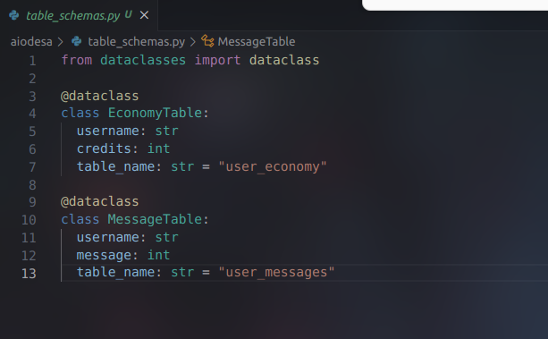
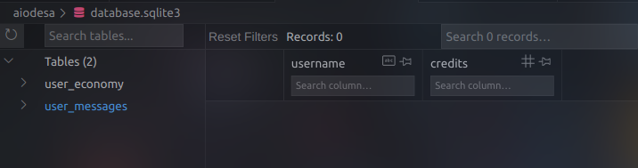

# Asyncio Dead Easy Sql API

## When you want to breeze past database complexity, use AIODesa

### This package simplifies the async creation and access API when you just want a dead simple sqlite database for your async projects. Its mostly just a wrapper around Asiosqlite and lets you define table and record schemas using pythons built-in dataclasses.dataclass.

AIODesa aims to make defining SQL tables and records easy by utilizing dataclasses to define schema of tables and records. Table and record schemas can be defined with a single data class, a tuple of multiple data classes, or a .py file with dataclasses defined inside.

For example, define your table schemas in schemas.py



Import db from the package and run with asyncio

main.py
```
from Database import Db
import asyncio


async def main():
	schema_file = "table_schemas.py"
	path_to_generate_db = "database.sqlite3"
	async with Db(path_to_generate_db) as db:
		await db.read_table_schemas(schema_file)

asyncio.run(main())
```

Tables are automatically generated


### Development:
Ensure poetry is installed:
```
pip install poetry
```

Install project using poetry
```
poetry add git+https://github.com/sockheadrps/AIODesa.git
poetry install
```

create a python file for using AIODesa and activate poetry virtual env to run it

```
poetry shell
poetry run python main.py
```

Sample API usage:
```
from dataclasses import dataclass
from Database import Db
import asyncio


async def main():
	@dataclass
	class Table:
		username: str
		credits: int
		table_name: str = "table 1"

	schema = Table
	
	async with Db("database.sqlite3") as db:
		await db.read_table_schemas(schema)

asyncio.run(main())
```
